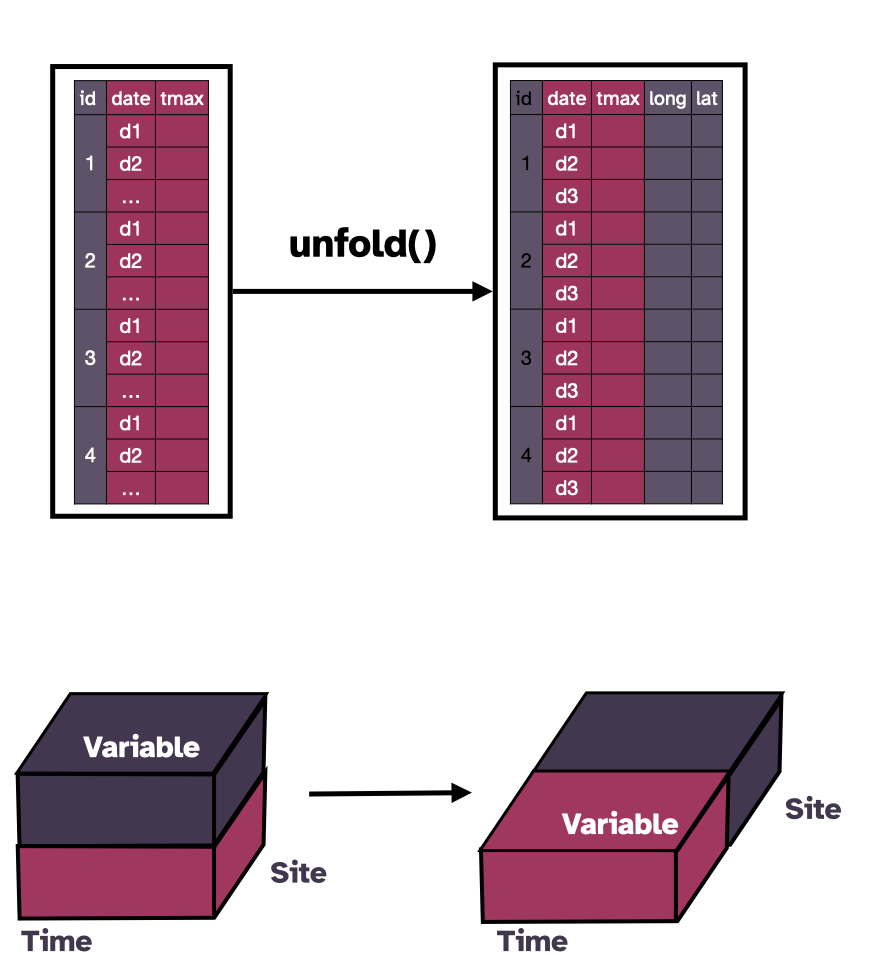

```{r setup, include=FALSE}
options(htmltools.dir.version = FALSE)
knitr::opts_chunk$set(echo = FALSE, 
                      message = FALSE, 
                      warning = FALSE, 
                      cache = TRUE, 
                      comment = NA,
                      fig.align='center')
wide_width <-  100
options(pillar.print_max = 5, 
        pillar.print_min = 5, 
        width = wide_width)


library(tidyverse)
library(tsibble)
library(cubble)
library(flair)
library(sf)
library(ggsvg)
light_purple <- colorRampPalette(c("black","#443750",  "white"))( 20 )[14]
light_pink <- colorRampPalette(c("#840032",  "white"))( 20 )[10]
```

```{r xaringan-scribble, echo=FALSE}
xaringanExtra::use_scribble()
```

```{r xaringan-themer, include=FALSE, warning=FALSE}
library(xaringanthemer)
style_duo_accent(
  primary_color = "#443750",  
  secondary_color = "#840032",
  title_slide_background_color = "#FFEECF",
  title_slide_text_color = "#443750",
  text_font_google = google_font("Atkinson Hyperlegible"),
  inverse_background_color = "#443750",
  header_font_google = google_font("Atkinson Hyperlegible"),
  header_background_padding = "1rem",
  header_background_content_padding_top = "6rem",
  text_font_size = "120%", 
  header_background_color = "#443750",
  header_background_auto = TRUE,
  code_inline_font_size = "0.9rem",
  link_color = "#FFEECF",
  inverse_link_color = "443750"
)
```


# Spatial data


.pull-left[

```{r}
ncs <- weatherdata::historical_tmax %>%
  filter(long > 151, lat < -32.5, lat > -33)

raw <- weatherdata::historical_tmax %>% 
  filter(between(stringr::str_sub(id, 7, 8), 46, 90)) %>% 
  filter(!id %in% c("ASN00071032", "ASN00071041", "ASN00063039")) %>%
  # remove sydney nearby (only leave sydney airport)
  filter(!id %in% c("ASN00063039", "ASN00066062", "ASN00066124",
                    "ASN00066137", "ASN00067033")) %>%
  # remove newcastle around area (only leave Nelson Bay)
  filter(!id %in% ncs$id[-1])

raw_stations <- raw %>% 
  select(id: wmo_id) %>% 
  ungroup()

stations_sf <- raw_stations %>%
  sf::st_as_sf(coords = c("long", "lat"), crs = 4283, remove = FALSE)
options(width = 50)

```

```{r echo = TRUE}
stations_sf
```

```{r}
options(width = wide_width)
```

]

.pull-right[

```{r fig.retina=3}
nsw <- ozmaps::abs_ste %>% rmapshaper::ms_simplify() %>% filter(NAME %in% c("New South Wales", "Victoria"))

svg <- readLines(here::here("figures/station-icon.svg"))
station_svg <- paste(svg, collapse = "\n")
#grid::grid.draw(svg_to_rasterGrob(station_svg))

ggplot() +
  geom_sf(data = nsw, fill = "grey95", color = "white") +
  geom_point_svg(
    data = stations_sf,
    aes(long,lat),
    css("path:nth-child(1)", fill = "#443750"),
    css("path:nth-child(2)", fill = "#443750"),
    css("path:nth-child(3)", fill = "#443750"),
    css("path:nth-child(4)", fill = "#443750"),
    css("path:nth-child(5)", fill = "#443750"),
    svg = station_svg) + 
  scale_svg_default() + 
  ggthemes::theme_map() 
  
```

]


???

* Thanks everyone for coming 

* The title of my talk today is

* Here is the link to this slide and the link now is also available in the chat. 

* Spatial data is a common type of data and here there are 59 weather stations distributed in New South Wales and Victoria in Australia

* The data is organised in an `sf` class and the package `sf` provides various geometrical operations in the space for this class 
---

# Temporal data

.pull-left-narrow[

```{r}
ts <- raw %>% 
  face_temporal() %>% 
  as_tibble() %>% 
  tsibble::as_tsibble(key = id, index = date) %>% 
  filter(lubridate::year(date) >= 1971)
options(pillar.print_max = 10)
```

```{r echo = TRUE}
ts
```
]

```{r}
options(pillar.print_max = 5)
```

.pull-right-long[

```{r fig.retina=3, fig.width=10}
ts %>% 
  filter(lubridate::year(date) == 2020) %>% 
  ggplot(aes(x = date, y = tmax, group = id)) + 
  geom_line(alpha = 0.5, color = "#840032") +
  scale_x_date(date_breaks = "3 months", date_labels = "%Y %b") + 
  theme_bw()
```

]

???

* Temporal data is another common data type 

* Here I'm showing you some daily historical temperature data for those 59 stations. 

* On the right, a fraction of the data in year 2020 is plotted

* This data is stored in a `tsibble` class, with `id` as the key to define each series and `date` as the index to define the time stamp. 

* The `tsibble` class allows you to  wrangle temporal data and build temporal models. 

---

# Spatio-temporal data 

When left joining an `sf` object with a `tsibble` object, the `tsibble` class (`tbl_ts`) gets lost: 

```{r sf-tsibble, echo = TRUE}
out <- stations_sf %>% left_join(ts, by = "id")
class(out)
```

When left joining the other way around, you lost the `sf` class:

```{r tsibble-sf, echo = TRUE}
out2 <- ts %>% left_join(stations_sf, by = "id")
class(out2)
```

???

* However, spatial objects and temporal objects do not naturally work well together for spatio-temporal analysis. 

* Here let me give you some examples

* If I join an sf object with a tsibble object, the tsibble class would gets lost

* If we join the data the other way around, the `sf` class will get lost.

---

# Multivariate spatio-temporal data

You can manually enforce the joined object to have both classes:

```{r echo = TRUE}
out2 <- ts %>% left_join(stations_sf, by = "id")
out3 <- out2 %>% st_as_sf()
class(out3)
```

but the class lost again after a `tsibble` operation: 

```{r echo = TRUE}
out4 <- out3 %>% tsibble::fill_gaps()
class(out4)
```

???

* We can manually enforce the joined object to have both classes with the function `st_as_sf()`

* But the class label can still get lost during operations.

* Here I use a tsibble function `fill_gaps` and the result doesn't have the `sf` class

* Also, taking a step back, the left join approach on spatial and temporal data is not necessarily the best way to structure spatio-temporal data 

* This is because all the feature geometries are repeated multiple times, especially for long daily data, like the temporal data I just show you.

* This motivates a new data representation 

---
class: center, inverse, middle

# Cubble

## A new tidy data structure to organise and wrangle spatio-temporal data

???

* Today I will introduce a new data structure, called cubble, to organise spatio-temporal data. 

* And we will see how data wangling with cubble can be fun 


---

# Multivariate spatio-temporal cubes

```{r}
knitr::include_graphics("figures/spatio-temporal-cube.png")
```


???

* Conceptually spatio-temporal data can be thought of as a data cube

* In this cube, the three axes are Time, Site, and Variable.

  * The axis **Site** defines the location of the entities

  * The axis **Variable** is used to represent multivariate information.

  * We define our data cube slightly different from a conventional cube to avoid introducing hypercubes for multivariate information.

* Operations on multivariate spatio-temporal data can be thought of as slicing and dicing on the cube. 

* Although The data cube is conceptually convenient, for data wrangling, a 3D array structure may not sufficiently rich, for example, to wrangle special date time classes.


---

# Cubble basics

```{r out.height=575}
knitr::include_graphics("figures/long-nested-form.png")
```


???

* Now I will demonstrate how cubble organises spatio-temporal data with two forms. 

* The nested form organises each site in a row. 

  * Spatial variables fixed for each site can be directly wrangled. 

  * Temporal variables varied across time are nested in a list column called `ts`. 

* On the other hand, the long form cubble organises each row by a combination of site and date, similar to a `tsibble`.

  * Temporal variables can be directly wrangled and
  
  * spatial variables are stored as a data attribute, which I will show you shortly in the code.
  
---
# Switching focus between time and space

```{r out.height=575}
knitr::include_graphics("figures/cubble-operations.png")
```

???

* In a spatio-temporal analysis, we may want to first subset a few location and then explore their temporal patterns.

* We may also want to first calculate some temporal features and then investigate its spatial distribution.

* These analyses would require switch between the nested form and the long form in a cubble

* The function `face_temporal()` turns a nested cubble into the long form and

* This can be used to first filter the location on the nested form and then use `face_temporal()` to switch the data into the long form and then make temporal summaries

* The inverse of `face_temporal()` is `face_spatial()`, which switches the long cubble into a nested one

* With `face_spatial()` we can first make some calculations on the temporal side and switch back to the nested form to view its spatial distribution on the map

---

# Creating a cubble

```{r echo = TRUE}
weather <- as_cubble(list(spatial = stations_sf, temporal = ts),
  key = id, index = date, coords = c(long, lat))

```

???

* Now I'm going to show you how to create a cubble from the two data we have 

* Here you specify the two separate objects in a list with the name `spatial` and `temporal`. 

* Then you can specify the `key` and the `index` as what you would do when creating a `tsibble`. 

* The `coords` argument needs to be specified in the order of longitude and latitude. 

--

```{r}
weather
```

???

* This creates a cubble in the nested form. 

--

- .sec[`r nrow(stations_sf)`] stations, in the nested form, and is a subclass of `sf` 
- The available temporal variables are `date` and `tmax` 
- Also, each temporal component in the list column is a tsibble (`tbl_ts`)


???

* The header of a cubble tells you that this data has 

---
# Cubble summary (1/2)

.pull-left-larger[

```{r echo = FALSE}
options(width = 50)
```

```{r face-temporal, eval = FALSE}
weather_long <- weather %>% face_temporal()
weather_long
```

```{r echo = FALSE}
decorate_chunk("face-temporal") %>%
  flair("face_temporal()", background = "#FFEECF") %>% 
  knit_print.with_flair(width = 50)
```

  - a long form cubble as the subclass of `tsibble` 
  - the third row now shows the spatial variables

]

???

* We can pivot this object into the long form with `face_temporal()`

* Now the object `weather_long` is a long form cubble and it is a subclass of tsibble

* The third line in the header now changes to see the available spatial variables

--

.pull-right[

```{r echo = TRUE}
attr(weather_long, "spatial") 
```
  

]

???

* The spatial variables are stored in the `spatial` attribute, which you can see through this command.  

* Here it is stored as an sf object

---
# Cubble summary (2/2)

```{r echo = FALSE}
options(width = wide_width)
```

```{r face-spatial, eval = FALSE}
weather_back <- weather_long %>% face_spatial()
weather_back

identical(weather_back, weather)
```

```{r echo = FALSE}
decorate_chunk("face-spatial") %>%
  flair("face_spatial()", background = "#FFEECF") %>% 
  knit_print.with_flair()
```
???

* Here is the code example of using the function `face_spatial()` on the long form cubble

* This would give us the nested cubble before making the switch to the long form

---

# Pipeline with cubble

.pull-left-narrow[
```{r cb-code, eval = FALSE}
cb_obj %>% 
  {{ Your spatial analysis }} %>% 
  face_temporal() %>% 
  {{ Your temporal analysis }} %>% 
  face_spatial() %>% 
  {{ Your spatial analysis }} 
```


```{r echo = FALSE}
decorate_chunk("cb-code", eval = FALSE) %>%
  flair("{{ Your spatial analysis }}" , background = light_purple) %>% 
  flair("{{ Your temporal analysis }}" , background = light_pink) %>% 
  flair("face_temporal()" , background = "#FFEECF") %>% 
  flair("face_spatial()" , background = "#FFEECF") %>% 
  knit_print.with_flair()

```

]

.pull-right-long[
```{r conv-code, eval = FALSE}
spatial <- stations_sf %>% 
  {{ Your spatial analysis }} 

##############################
# more subsetting step if temporal analysis
# depends on spatial results
sp_id <- spatial %>% pull(id)
ts_subset <- ts %>% filter(id %in% sp_id)
##############################

temporal <- ts_subset %>% 
  {{ Your temporal analysis }} 

##############################
# more subsetting step if spatial analysis 
# depends on temporal results
ts_id <- temporal %>% pull(id)
sp_subset <- spatial %>% filter(id %in% ts_id)
##############################

sp_subset %>% 
  {{ Your spatial analysis }} 
  
```

<!-- # "#443750",  secondary_color = "#840032", -->
```{r echo = FALSE}

decorate("conv-code", eval = FALSE) %>%
  flair("{{ Your spatial analysis }}" , background = light_purple) %>% 
  flair("{{ Your temporal analysis }}" , background = light_pink) %>% 
  flair("sp_id <- spatial %>% pull(id)" , background = "#FFEECF") %>% 
  flair("ts_subset <- ts %>% filter(id %in% sp_id)" , background = "#FFEECF") %>% 
  flair("ts_id <- temporal %>% pull(id)" , background = "#FFEECF") %>% 
  flair("sp_subset <- spatial %>% filter(id %in% ts_id)" , background = "#FFEECF") %>% 
  knit_print.with_flair()
```
]


???

* Here is a syntax comparison with and without cubble

* With cubble, you can do some spatial analysis in the nested form, pivot it to the long form for some temporal analysis, and then pivot it back to the nested form for some additional spatial analysis. 

* Sometimes, the spatial analysis include extracting some interesting sites.

* Without cubble, you will need to first pull out those interesting ids, and then filter the temporal data on these sites.

* Similar steps can also happen in the temporal analysis and the spatial data needs to be updated.

* In cubble, these updates are automatically handled by `face_temporal()` and `face_spatial()` and no manual updates are needed.

* Also the cubble pipeline chains all the operations together with no intermediate objects created in the workflow.

---
class: center, inverse, middle

# Spatio-temporal analysis in cubble

## A glyph map example

???

* Some analysis uses both spatial and temporal of variables at the same time. 

* An example of this is making glyph maps.

* Here I will first show you a toy example before rolling out to the full picture


---
# Transform a dot into a glyph

```{r}
knitr::include_graphics(here::here("figures/glyph-steps1.png"))
```

???

* A glyph map is a transformation of temporal coordinates into the spatial coordinates, so that temporal information can be visualised on the map.

* Here I have one weather station on the map and its maximum temperature on each day in January 2020

---
# Transform a dot into a glyph

```{r}
knitr::include_graphics(here::here("figures/glyph-steps2.png")) 
```

???

* A glyph map uses linear algebra to make this transformation

* You can see here the line in the bottom right plot does not change but its coordinates have been changed to the spatial coordinates

* In a glyph map, the spatial coordinates are called the major coordinates and the temporal coordinates are the minor coordinates.

* In the word of ggplot, we need four aesthetics to make a glyph map. Here they are longitude, latitude, date, and tmax.  

---

# Transformation to glyphmap

.pull-left[
```{r out.height=500, out.width = 500}

```

]

.pull-right-larger[
```{r}
options(width = 60)
```


```{r unfold, eval = FALSE}
cb_glyph <- weather_long %>% unfold(long, lat)
```

```{r echo = FALSE}
decorate_chunk("unfold") %>%
  flair("unfold()", background = "#FFEECF") %>% 
  knit_print.with_flair(width = 50)
```

```{r}
cb_glyph
```

```{r eval = FALSE, echo = TRUE}
cb_glyph %>% 
  ggplot(aes(x_major = long, y_major = lat, 
             x_minor = date, y_minor = tmax)) + 
  geom_glyph()
```

]

???

* To work with ggplot2, all the four variables need to be in the same table.

* In cubble you can use the function `unfold()` to relocate spatial variables into the long form. 

* Here I have the diagram, cube, and the code to demonstrate this function.

* This is how the data looks like after the unfold

* After this, the data can be piped into the ggplot with the four aesthetics need for `geom_glyph()` to draw the glyph map. 


---

# Example: Australian temperature comparison

```{r out.height=530, out.width="90%"}
knitr::include_graphics(here::here("figures/temperature-workflow.png"))
```

???

* Now here is an full example that combines everything I have introduced in this talk, to analyse historical temperature data in Australia. 

* We have maximum temperature dated back to the 70s, which allows us to compare the maximum temperature between now and then, and also across space.

* The diagram here shows each step needed in this analysis

* The data I have shown you in this talk is a subset from all the weather stations in Australia and there are hundreds of them.

* The first step here is to narrow it down to those in New South Wales and Victoria

* Then we pivot it into the long form to select a historical segment (from 1971 - 1975) and a recent segment (from 2016 to 2020) in step 2. 
  
* In step 3, still in the long form, maximum temperature is summarised into monthly average in each period

* A quick check on the number of observations reveals that some stations don't have temperature recorded at both groups - look at id 4

* We remove them in the nested form in step 4

* In step 5 and 6 we unfold longitude and latitude with temporal variables and make the glyph map with `geom_glyph()`

---
# Example: Australian temperature comparison

.pull-left-larger[

<br>

```{r glyph, eval = FALSE}
tmax <- DATA %>% 
  {{filter NSW & VIC stations}} %>% 
  face_temporal() %>% 
  {{group by month and period (71-75, 16-20)}} %>% 
  {{summarise into monthly average}} %>% 
  face_spatial() %>% 
  {{filter out sites with no historical record}} %>% 
  face_temporal() %>% 
  unfold(long, lat)

tmax %>% 
  ggplot(aes(x_minor = month, y_minor = tmax, 
             x_major = long, y_major = lat)) + 
  geom_glyph() + 
  ...
```

```{r echo = FALSE}
decorate_chunk("glyph", eval = FALSE) %>%
  flair("face_spatial()", background = "#FFEECF") %>% 
  flair("face_temporal()", background = "#FFEECF") %>% 
  flair("{{filter NSW & VIC stations}}" , background = light_purple) %>%
  flair("{{filter out sites with no historical record}} " , background = light_purple) %>% 
  flair("{{group by month and period (71-75, 16-20)}}" , background = light_pink) %>% 
  flair("{{summarise into monthly average}}" , background = light_pink) %>% 
  flair("unfold(long, lat)", background = "#FFEECF") %>% 
  flair("geom_glyph()", background = "#FFEECF") %>% 
  knit_print.with_flair()
```

]

.pull-right[

```{r inset, eval = FALSE}
tmax |> filter(id == "ASN00048027") |>
  ggplot(aes(x = month,
             y = tmax,
             color = group)) +
  geom_line(size = 1.5) +
  scale_color_brewer(palette = "Dark2", guide = "none") +
  scale_x_continuous(breaks = seq(1, 12, 1), 
                     labels = c("J", "F", "M", "A", "M", "J", 
                                "J", "A", "S", "O", "N", "D")) +
  labs(x = "", y  = "Temp (C)", title = "ASN00048027: Cobar") +
  theme_bw() +
  theme(
    aspect.ratio = 0.3,
    axis.text = element_text(size = 20),
    title =  element_text(size = 20)
  )
ggsave(filename = here::here("figures/cobar-inset.png"), width = 7, height = 3)
```

```{r fig.retina=3}
tmax <- weatherdata::historical_tmax %>% 
  filter(between(stringr::str_sub(id, 7, 8), 46, 90)) |>
   filter(!id %in% c("ASN00071032", "ASN00071041", "ASN00063039")) %>%
  # remove sydney nearby (only leave sydney airport)
  filter(!id %in% c("ASN00063039", "ASN00066062", "ASN00066124",
                    "ASN00066137", "ASN00067033")) %>%
  # remove newcastle around area (only leave Nelson Bay)
  filter(!id %in% c("ASN00059040", "ASN00072091")) %>% 
  # two wired ones
  face_temporal() |>
  filter(lubridate::year(date) %in% c(1971:1975, 2016:2020)) %>% 
  group_by(month = lubridate::month(date),
           group = as.factor(ifelse(lubridate::year(date) > 2015,
                                    "2016 ~ 2020", "1971 ~ 1975"))) |>
  summarise(tmax = mean(tmax, na.rm = TRUE)) %>% 
  face_spatial() |> 
  filter(nrow(ts) == 24) %>% 
  face_temporal() |> 
  unfold(long, lat)

nsw_vic <- ozmaps::abs_ste |> filter(NAME %in% c("Victoria", "New South Wales"))

p1 <- ggplot() + 
  geom_sf(data = nsw_vic, fill = "grey95", color = "white") + 
  geom_glyph(data = tmax, 
             aes(x_major = long, x_minor = month, 
                 y_major = lat, y_minor = tmax,
                 group = interaction(id, group), 
                 color = group),
             width = 1, height = 0.4) +
  scale_color_brewer("", palette = "Dark2") + 
  coord_sf(xlim = c(141, 154), ylim = c(-39, -28.5)) + 
  theme_void() + 
  ggthemes::theme_map() +
  theme(legend.position = "bottom", 
        #legend.key.size = unit(3,"line"),
        legend.text = element_text(size = 15)
        ) + 
  guides(color = guide_legend(override.aes = list(size=3)))
#ggsave(p1, file = "figures/glyph.png", dpi = "retina")

box_df <- tmax |> face_spatial() |> filter(id == "ASN00048027")
single <- tibble::tibble(img = here::here("figures/cobar-inset.png"))

p1 +
  geom_rect(data = box_df,
            aes(xmin = long - 0.6, xmax = long + 0.6,
                ymin = lat - 0.15, ymax = lat + 0.25),
            fill = "transparent", color = "black") +
  ggimg::geom_point_img(
    data = single, aes(x = 143.5, y = -30, img = img), size = 6)
```


]

???

* This is the code version of the diagram illustration 

* Functions highlighted in light yellow are developed in the cubble package 

* Spatial operations are highlighted in purple and temporal ones in pink

* On the top left of the plot is a more annotated version of the glyph for one specific station Cobar.

* Australia has a U-shape temperature curve and if you look carefully, the inland NSW stations has a noticeable higher average maximum temperature in January in recent years.


```{r}
map <- ozmaps::abs_ste %>% rmapshaper::ms_simplify()
nsw <- map %>% filter(NAME == "New South Wales")
```


---
class: inverse, middle

# More you can do with cubble

* Pick up unmatched entries from the spatial and temporal inputs

???

There are more things cubble can do

--

* Merge two data sources by spatial and temporal similarities

--

* Handle (spatial) hierarchical structure of sites

--

* Input data can be of various forms, including a single combined data frame and netCDF

---
background-image: url("figures/3cubes-in-one.png")
background-position: 90% 70%
background-size: 280px, 280px

class: inverse,  middle

# Additional Information

Slides created via the R package [.inverse-code[xaringan]](https://github.com/yihui/xaringan) and [.inverse-code[xaringanthemer]](https://github.com/gadenbuie/xaringanthemer), available at 

.inverse-code[https://sherryzhang-user2022.netlify.app]

<br>

.inverse-code[`r fontawesome::fa("link")`] Install the latest version of cubble:

.inverse-code[remotes::install_github("huizezhang-sherry/cubble")]

<br>

H. Sherry Zhang [.inverse-code[`r fontawesome::fa("github")`]](https://github.com/huizezhang-sherry) [.inverse-code[`r fontawesome::fa("twitter")`]](https://twitter.com/huizezhangsh)

Collaborators: Dianne Cook, Patricia Menéndez, Ursula Laa, and Nicolas Langrené

???

* This wraps up my presentation today 

* Cubble has already made its way to CRAN 

* There has been some major changes made in the last few months and we plan to make an CRAN update very soon. 

* So keep an eye on my github and twitter. 

* Thanks for your time :)


