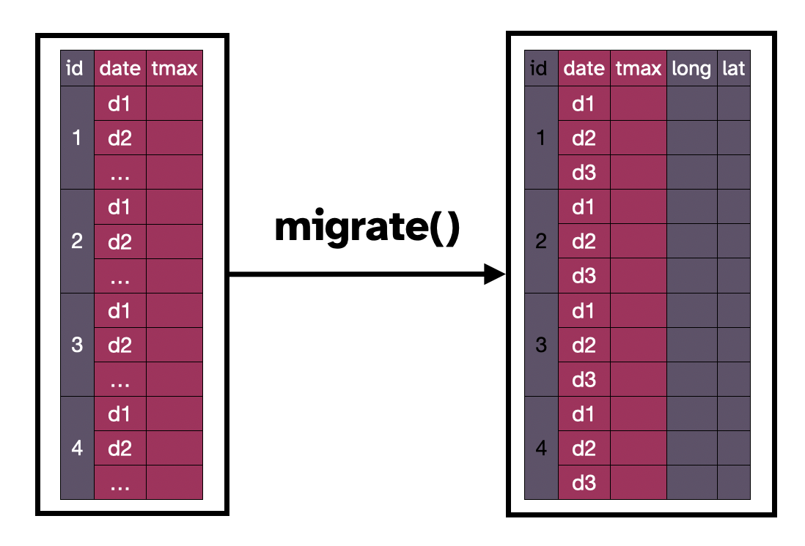
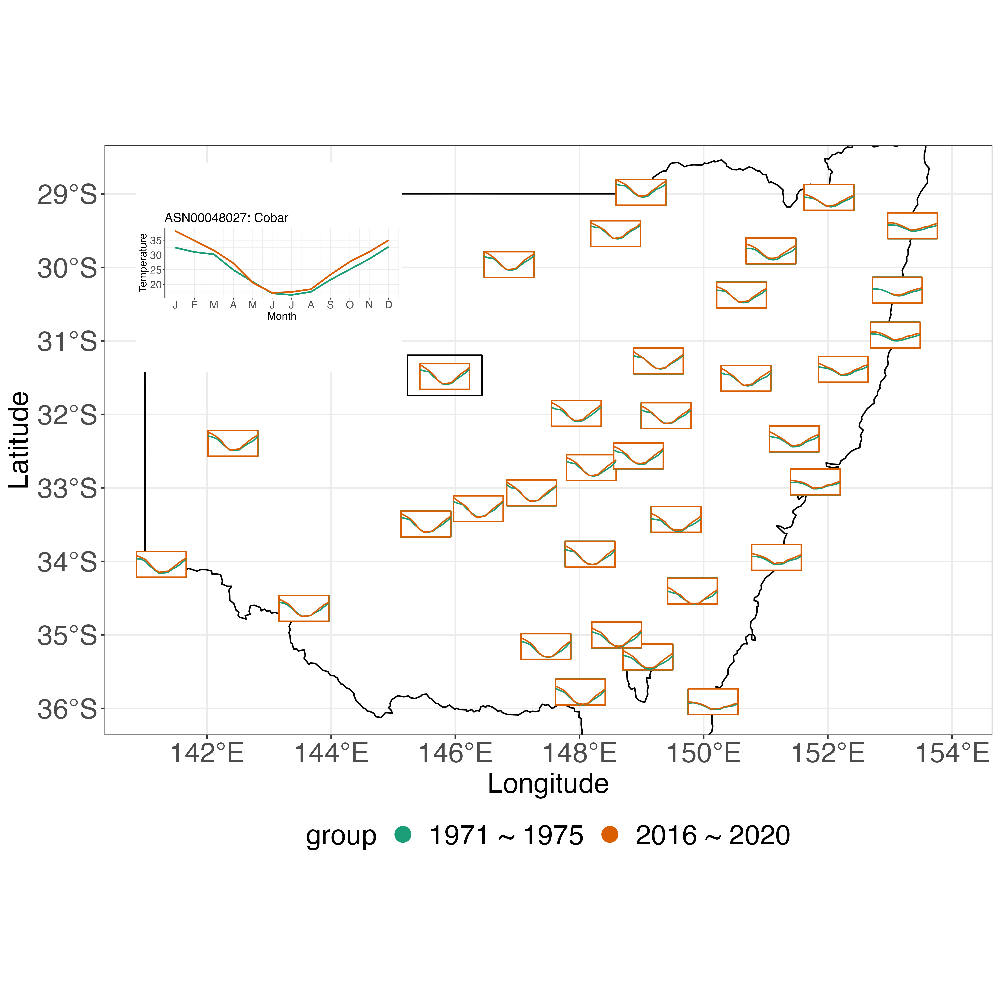

```{r setup, include=FALSE}
options(htmltools.dir.version = FALSE)
knitr::opts_chunk$set(echo = FALSE, 
                      message = FALSE, 
                      warning = FALSE, 
                      cache = TRUE, 
                      comment = NA,
                      fig.align='center', eval = FALSE)

options( pillar.print_max = 5, pillar.print_min = 5, width = 45)
library(tidyverse)
library(cubble)
library(flair)
```


```{r xaringan-themer, include=FALSE, warning=FALSE}
library(xaringanthemer)
style_duo_accent(
  primary_color = "#443750",  
  secondary_color = "#840032",
  title_slide_background_color = "#FFEECF",
  title_slide_text_color = "#443750",
  text_font_google = google_font("Atkinson Hyperlegible"),
  inverse_background_color = "#443750",
  header_font_google = google_font("Atkinson Hyperlegible"),
  header_background_padding = "1rem",
  header_background_content_padding_top = "6rem",
  text_font_size = "120%", 
  header_background_color = "#443750",
  header_background_auto = TRUE,
  code_inline_font_size = "0.9rem",
  link_color = "#FFEECF",
  inverse_link_color = "443750"
)
```


# Multivariate spatio-temporal data

```{r out.height = 550, out.width=1000}
knitr::include_graphics("figures/diagrams/diagrams.001.png")
```


???

* Thanks everyone for coming 

* The title of my talk today is

* In my supervisor team are

* Here is the link to this slides, in case you would like to go back and forth while I'm talking

* MST data are commonly collected in different areas  

* some examples of these include 

  * climate variables measured by weather stations over time, 
  
  * pollutant data monitored by air quality meters, and 
  
  * river level data recorded by river gauges over different periods.


---

# Multivariate spatio-temporal data

```{r out.height = 550, out.width=1000}
knitr::include_graphics("figures/diagrams/diagrams.009.png")
```


???

* Conceptually MST data can be thought of as a data cube with three axes: site, time, and variable


---

# Multivariate spatio-temporal data

```{r out.height = 550, out.width=1000}
knitr::include_graphics("figures/diagrams/diagrams.010.png")
```

???

* And to analyse this type of data, we can

  * fix the time to look at the spatial distribution of variables; 
  * fix the location to look at the temporal variation, like trend and seasonality; or 
  * look at relationship among variables across time and space

---

# Motivation 

.pull-left[

Data from National Oceanic and Atmospheric Administration (NOAA)

```{r}
knitr::include_graphics("figures/spatial.png")
```

```{r out.width="50%"}
knitr::include_graphics("figures/temporal.png")
```

]

.pull-right-larger[

* Multivariate spatio-temporal data usually come in multiple pieces

* This makes it easy for data collection but not for data analysis

* A new data structure, `cubble`, that
  * organises different pieces in a single data object
  * allows users to access variables easily in the analysis

* Three examples:
  * Interactive graphics
  * Glyph map
  * Data with hierarchical structure
]

???

* Now let's change the topic and look at some climate data

* NOAA hosts worldwide climate data

* To get data from there, you will first need to query the locations and variables of interest. This gives a spatial table on the top

* Then you will query the temporal information based on the spatial table

* This is an example where MST

* Today I will introduce a new data structure, cubble, that allows you to organise spatio-temporal data in a different way

* so that different pieces of information all live in a single data object and users can easily access variables during the analysis

* I will illustrate the data structure with three examples in this talk

---

# Cubble basics
```{r out.height=575}
knitr::include_graphics("figures/diagrams/diagrams.003.png")
```


???

* The way cubble work is to organise the data in two forms

* Here I use two colors to represent the spatial and temporal variables

* The nested cubble has each location in a row 

* It has spatial variables like longitude, latitude, among others and temporal variables all nested in a ts column. 

* In the long cubble, each row is identified by a combination of location and date. 
  
* spatial variables are stored separately as the data attributes, which I will later show you through the code
  
---
# Switching focus between time and space

```{r out.height=575}
knitr::include_graphics("figures/diagrams/diagrams.004.png")
```

???

* Here is how you can switch between the nested and long form

* The verb `stretch()` switches the nested cubble into the long form and

* This change the focus from the spatial to temporal aspect and the resulting long form can be used to summarise the temporal aspect of the data.

---
# Switching focus between time and space

```{r out.height=575}
knitr::include_graphics("figures/diagrams/diagrams.013.png")
```

???

* The inverse of `stretch()` is `tamp()`, which switches the long cubble into a nested one

* This changes the focus back to the spatial aspect and can be used to view the spatial distribution of variables on the map

---

# Creating a cubble

.pull-left[

```{r}
knitr::include_graphics("figures/raw.png")
load(here::here("data/raw.rda"))
```

```{r}
knitr::include_graphics("figures/raw-2.png")
```


]

.pull-right[


```{r echo = TRUE}
cb_nested <- raw %>%
  as_cubble(key = id, 
            index = date, 
            coords = c(long, lat))
```
]

???

* Now I'm going to show you how cubble looks like in the code

* With the spatial and temporal table I show you early one, there are different ways you can cast them into a cubble

* The first one joins the two tables by id into a combined data, and

* The second one uses a rowwise structure to query the temporal variables directly into a list column, you can see the header here it is a rowwise data frame and each element in the `ts` column has 366 rows and four variables

* With either form, you can use `as_cubble` function and supply three arguments, the key, the index, and the coordinates, which are the three important information in MST data


---

# Cubble summary (1/2)

```{r eval = FALSE, echo = TRUE}
cb_nested
```

```{r}
options(width = 345)
cb_nested
```

???

* By default, this create a nested cubble. 

* There is a header summary on cubble objects, here it tells you


--

- There are .sec[638] stations in this data 
- Temporal variables are `date, prcp, tmax`, and `tmin`
- Spatial variables: `lat, long, elev, name`, and `wmo_id`
- Each temporal component is a tibble, .sec[366] rows for each station

---

# Cubble summary (2/2)

.pull-left[
```{r}
cb_long <- cb_nested %>% stretch()
options(width = 45)
```

```{r echo = TRUE}
cb_long <- cb_nested %>% stretch()
cb_long
```


]

???

* This is what the long cubble looks like

---
# Cubble summary (2/2)


.pull-left[
```{r}
cb_long <- cb_nested %>% stretch()
options(width = 45)
```

```{r echo = TRUE}
cb_long <- cb_nested %>% stretch()
cb_long
```


* Notice: `# spatial: lat [dbl], long [dbl], elev [dbl], name [chr], wmo_id [dbl]`


]

--

.pull-right[
```{r echo = TRUE, results='hold'}
attr(cb_long, "spatial")
# or you can use: spatial(climate_long)
```

]


---
# Example 1: creating interactive graphics

```{r}
knitr::include_graphics("figures/diagrams/diagrams.008.png")
```

???

* With the two forms and the verbs I just introduced, I will now show you how to use cubble to link a map view with a temporal display

* Here the example is to explore seasonality of temperature at various locations in Australia

* I will first illustrate how the linking in interactive graphic works with cubble before showing you the graphic.

* A map can be crated the nested cubble where each point corresponds to a row and color by a particular variable of interest

* With the long cubble, you can make a temporal display. 

* In this illustration, the rows that share the same id in the long form is a line and the same color as used as the map

* Once a point is selected on the map, it will activate the corresponding row in the nested cubble

---

# Example 1: creating interactive graphics

```{r}
knitr::include_graphics("figures/diagrams/diagrams.017.png")
```

???

* The nested cubble will then be linked to the long cubble and the rows in the long cubble with the same id will be activated.


---
# Example 1: creating interactive graphics

```{r}
knitr::include_graphics("figures/diagrams/diagrams.018.png")
```

???

* These activated rows in the long form will then highlight selected time series in the plot

* This linking also works in the other direction, where you can make a selection on the temporal display and it wil highlight the corresponding location on the map

---
class: inverse, middle

```{r out.height=550}
knitr::include_url("figures/interactive-graphic.mov", height = "400px")
```


???

* Here I record a video to show how select and highlight looks like in the plot. 

* The locations are colored by monthly variation of temperature difference

* This is a measure of how the temperature difference, maximum - minimum, varies across each month. For example, if you have a location with almost constant difference throughout the year, it will have a small value.

* Rather than showing a line of in the temporal display, here we use a ribbon, where the upper bound is the maximum temperature and ...

* Here I first select a point on the right with the lowest temperature in August and you can see it corresponds to the thredbo and it has a fairly constant temperature difference throughout the year, although fiarly low

* Another point I'm interesting to explore is Mount Elizabeth since it has a large variance in temperature difference and I'm interested to know how the maximum and minimum temperature look like in each month. 

* We can see here the large variance comes from its wide gap in the winter season from June to August
---

# Transformation to glyphmap

<!-- (context of problem): compare seasonal temperature for two periods  -->

<!-- drop missing -->
<!-- migrate  -->
<!-- transform -->

<!-- What if you want to work with  both spatial or temporal variables? -->

.pull-left[
```{r out.height = 400, out.width = 500}

```

]

???

* With cubble, you can also do some spatio-temporal transformation and the particular one we will talk about today is the glyph map. 

* A glyph map requires both spatial and temporal variables for the transformation.

* In this transformation, you need longitude, latitude, and the variable of interest across time

* In cubble you can temporarily move some spatial variables into the long form using the verb `migrate()`

* Here is the illustrate and the code shows you with the long form, you migrate long and lat


--

.pull-right-larger[
```{r}
options(width = 60)
```


```{r echo = TRUE}
cb_migrated <- cb_long %>% 
  migrate(long, lat)
cb_migrated
```
]


---

# Example 2: Australian temperature revisit


```{r out.height = 525}
knitr::include_graphics("figures/diagrams/diagrams.005.png")
```

???

* Here is a much involved example of comparing Australia temperature in two time periods

* The data used for this example has a simlar structure as before has a long period that dated back to the 70s, so we can compare how the maximum temperature looks like in the past and nowadays

* The diagram here shows how different steps in the data analysis can be chained together with cubble 

* Start with all Australia data, we can first filter out the NSW stations in the space, and then stretch to the long form to filter on the two time periods

* Then with the long form, the maximum temperature is summarised into monthly average

* In step 4 we switch back to the nested form to find that some stations don't have history records and drop those

* In step 5, we switch to the long form again and migrate the longitude and latitude to prepare for the glyph map transformation. 

* And lastly the glyphmap transformation gives you a map.

---


.pull-left-larger[

```{r glyph, eval = FALSE, include = FALSE}
tmax <- DATA %>% 
  filter(NSW_STATIONS) %>% 
  stretch() %>% 
  filter(DATE_IN_TWO_GROUPS) %>% 
  summarise() %>% 
  tamp() %>% 
  filter(NO_MISSING_VALUE) %>% 
  stretch() %>% 
  migrate(long, lat)

tmax %>% 
  ggplot(aes(x_minor = lubridate::month(date), 
             y_minor = tmax, 
             x_major = long, 
             y_major = lat)) + 
  geom_glyph_box() + 
  geom_glyph()
```

```{r echo = FALSE}
flair::decorate_chunk("glyph", eval = FALSE) %>%
  flair::flair("stretch", background = "#FFEECF") %>% 
  flair::flair("tamp", background = "#FFEECF") %>% 
  flair::flair("migrate", background = "#FFEECF") %>% 
  flair::flair("geom_glyph_box", background = "#FFEECF") %>% 
  flair::flair("geom_glyph", background = "#FFEECF") %>% 
  flair::knit_print.with_flair()
```

]


.pull-right[
```{r}

```
]

???

* This is the code version of the previous diagram and the functions highlighted here are I developed in cubble

* In the plot, I show an enlarged legend of one station Cobar

* In each glyph, I plot the averaged maximum temperature for September to February for the two periods

* One information I read from this plot is in the past, the average maximum temperature from December to February are almost the same, while these days, January stands out to be hotter for the inland stations


---

# Working with hierarchical data (1/2)

```{r out.height="90%"}
knitr::include_graphics("figures/diagrams/diagrams.006.png")
```

???

* MST data can have a grouping structure on the space

* Sometimes, rather than exploring the pattern of each individual location, we may want to explore multiple locations together as a group.

* For our climate data, 638 glyph maps would be too much to look at and we can divide them into clusters and view the glyph map of each cluster.

* Here the station nested has a new column called cluster. This is the grouping variable and in the later example we will be using a kmeans cluster to allocate stations into 20 groups

* The cubble function `switch_key()` will reorganise the cubble into the cluster level. Now rather than each station forms a row, each cluster forms a row and you can add other cluster level variables in the column, for example latitude and longitude of cluster centroid. All the station level spatial variables are now nested in the .val column

---

# Working with hierarchical data (2/2)

```{r out.height="90%"}
knitr::include_graphics("figures/diagrams/diagrams.007.png")
```

???

* To get access to the long form, you can still use the `stretch()` verb
---
background-image: url("figures/diagrams/diagrams.014.png")
background-position: bottom right
background-size: 280px, 280px

# Example 3: Australian rainfall

```{r}
load(here::here("data/station_nested.rda"))
station_nested <- station_nested %>% filter(id != "ASN00099005")
options(width = 145)
```

```{r echo = TRUE}
station_nested
```

???

* This is how our station_nested data look like

* We have similar spatial variables with a new cluster column

* The precipitation has already been summarised into weekly mean in the ts column and it has 53 rows and 2 columns, wk and prcp

---
background-image: url("figures/diagrams/diagrams.014.png")
background-position: top right
background-size: 280px, 280px

.pull-left-larger[
```{r hier-cluster, eval = FALSE}
cluster_nested <- station_nested %>% 
  switch_key(cluster) %>% 
  get_centroid() 

ggplot() + 
  geom_sf(data = ozmaps::abs_ste, ...) + 
  geom_point(data = station_nested, aes(...)) + 
  ggforce::geom_mark_hull(
    data = cluster_nested %>% ..., 
    aes(...))
```


```{r}
flair::decorate_chunk("hier-cluster", eval = FALSE) %>% 
  flair::flair("station_nested", background = "#FFEECF") %>% 
  flair::flair("cluster_nested", background = "#C88DA3") %>%
  flair::knit_print.with_flair()
```
]

.pull-right[
```{r}
knitr::include_graphics("figures/hier-cluster.png")
```

]

???

- With station_nested, you can use the `switch_key()` to change it to the cluster level. 

- `get_centroid()` in cubble will find the centroid of each cluster

- Then this two datasets can be used to view the cluster membership of each locations on the map

---
background-image: url("figures/diagrams/diagrams.014.png")
background-position: top right
background-size: 280px, 280px

.pull-left-larger[

```{r hier-glyph, eval = FALSE}
cluster_nested <- station_nested %>% 
  switch_key(cluster) %>%
  get_centroid()

cluster_long <- cluster_nested %>% 
  stretch() %>% 
  migrate(cent_long, cent_lat)

ggplot() + 
  geom_sf(data = ozmaps::abs_ste, ...) + 
  geom_glyph(data = cluster_long, aes(...)) + 
  geom_text(data = cluster_nested, aes(...)) + 
  ...
```

```{r}
flair::decorate_chunk("hier-glyph", eval = FALSE) %>% 
  flair::flair("station_nested", background = "#FFEECF") %>% 
  flair::flair("cluster_nested", background = "#C88DA3") %>%
  flair::flair("cluster_long", background = "#978F9D") %>%
  flair::knit_print.with_flair()
```


]

.pull-right[
```{r}
knitr::include_graphics("figures/hier-glyph.png")
```

]


---
class: inverse, middle

# More you can do with cubble

* Merge two data sources by spatial and temporal similarities

--

* Alternative objects accepted as components:

  * Spatial data can be represented as an .inverse-code[sf] or .inverse-code[S2 LngLat], spatial objects

  * Temporal data can be represented as a .inverse-code[tsibble], a special temporal data object

--

* Input data can be of various forms, including .inverse-code[netCDF] and .inverse-code[tibble variates] (i.e. grouped and rowwise data frame)

---
background-image: url("figures/3cubes-in-one.png")
background-position: 90% 70%
background-size: 280px, 280px

class: inverse,  middle

# Additional Information

Slides created via the R package [.inverse-code[xaringan]](https://github.com/yihui/xaringan) and [.inverse-code[xaringanthemer]](https://github.com/gadenbuie/xaringanthemer), available at 

.center[https://sherryzhang-user2022.netlify.app]

<br>

.inverse-code[`r fontawesome::fa("link")`] cubble package: https://github.com/huizezhang-sherry/cubble

<br>

H. Sherry Zhang [.inverse-code[`r fontawesome::fa("github")`]](https://github.com/huizezhang-sherry)

Supervisors: Dianne Cook, Patricia Menéndez, Ursula Laa, and Nicolas Langrené


