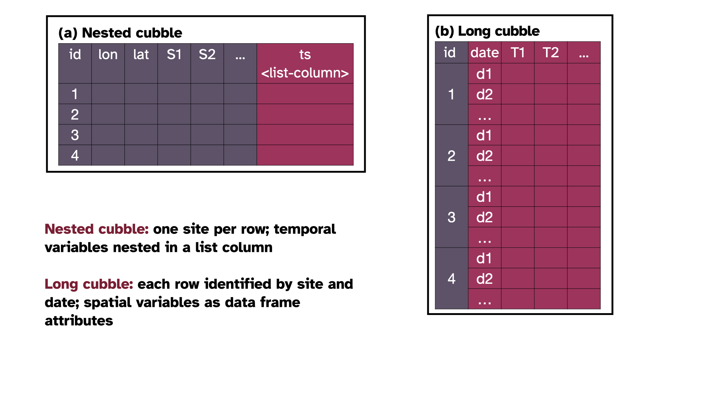

```{r setup, include=FALSE}
options(htmltools.dir.version = FALSE)
knitr::opts_chunk$set(echo = FALSE, 
                      message = FALSE, 
                      warning = FALSE, 
                      cache = TRUE, 
                      comment = NA,
                      fig.align='center')
wide_width <-  100
options(pillar.print_max = 5, 
        pillar.print_min = 5, 
        width = wide_width)


library(tidyverse)
library(cubble)
library(flair)
library(sf)
```

```{r xaringan-scribble, echo=FALSE}
xaringanExtra::use_scribble()
```

```{r xaringan-themer, include=FALSE, warning=FALSE}
library(xaringanthemer)
style_duo_accent(
  primary_color = "#443750",  
  secondary_color = "#840032",
  title_slide_background_color = "#FFEECF",
  title_slide_text_color = "#443750",
  text_font_google = google_font("Atkinson Hyperlegible"),
  inverse_background_color = "#443750",
  header_font_google = google_font("Atkinson Hyperlegible"),
  header_background_padding = "1rem",
  header_background_content_padding_top = "6rem",
  text_font_size = "120%", 
  header_background_color = "#443750",
  header_background_auto = TRUE,
  code_inline_font_size = "0.9rem",
  link_color = "#FFEECF",
  inverse_link_color = "443750"
)
```


# Spatial data

```{r}
raw <- weatherdata::historical_tmax %>% 
  filter(between(stringr::str_sub(id, 7, 8), 46, 75))

raw_stations <- raw %>% 
  select(id: wmo_id) %>% 
  ungroup()

stations_sf <- raw_stations %>%
  sf::st_as_sf(coords = c("long", "lat"), crs = 4283, remove = FALSE)
```

```{r echo = TRUE}
stations_sf
```

]

???

* Thanks everyone for coming 

* The title of my talk today is

* In my supervisor team are

* Here is the link to this slides, in case you would like to go back and forth while I'm talking

* Spatial data is common and here is a [...]

* The sf class uses a list column to store the feature geometries, including points, lines, polygons, multipolygons

* With the sf class, we can do various geometrical operations in the space

---

# Temporal data

```{r}
ts <- raw %>% face_temporal() %>% tsibble::as_tsibble(key = id, index = date)
```

```{r echo = TRUE}
ts
```


???

* Temporal data is also common 

* Here we have an object named `ts`, which contains ...

* It is stored in a `tsibble` class with `id` as the key to define each series and `date` as the index to define the time stamp. 

* With the `tsibble` class, you can do many temporal wrangling and build temporal models. 

---

# Spatio-temporal data 

When left joining an `sf` object with a `tsibble`, the `tsibble` class gets lost: 

```{r echo = TRUE}
out <- stations_sf %>% left_join(ts, by = "id")
class(out)
```

When left joining the other way around, you lost the `sf` class:

```{r echo = TRUE}
out2 <- ts %>% left_join(stations_sf, by = "id")
class(out2)
```

???


* However, these spatial objects and temporal objects are punching each other's face when combined together for spatio-temporal analysis. 
* Here if I join ...

* if I join it ...

---

# Multivariate spatio-temporal data

You can manually coerce the joined object to have both classes:

```{r echo = TRUE}
out3 <- out2 %>% st_as_sf()
class(out3)
```

but the class lost again after a `tsibble` operation: 

```{r echo = TRUE}
out4 <- out3 %>% tsibble::fill_gaps()
class(out4)
```

???

* There is ways to enforce both the `tsibble` and `sf` class in the data object. 

* But the class label can still get lost when using operations from one class. 

* Here I use a tsibble function `fill_gaps` and the output no longer has the `sf` class

* Also, taking a step back, a simple join of the spatial and temporal data is not the best way to structure spatio-temporal data since all the feature geometries are repeated multiple times, especially for long daily data.  
---
class: center, inverse, middle

# Cubble

## A new tidy data structure to organise and wrangle spatio-temporal data

???

* This motivates a new data representation for spatio-temporal data

* Today I will introduce a new data structure, called cubble, to organise spatio-temporal data. 

* And we will see how wangling spatio-temporal data can be fun with cubble


---

# Multivariate spatio-temporal cubes

```{r}
knitr::include_graphics("figures/spatio-temporal-cube.png")
```


???

* To think about spatio-temporal data conceptually, we introduce a multivariate spatio-temporal cube

* Here the cube is defined slightly different from a conventional spatio-temporal cube. 

* Rather than stacking spatial snapshots across time, here the cube has three axes: Time, Site, and Variable

* Here latitude and longitude only takes one dimension as **Site** and make an assumption that an entity has a fixed location. 

* **Variable** is used to represent multivariate information in the spatio-temporal data. 

* We define the data in this way to avoid introducing hypercubes for multivariate information. 

* With this cube, operations on multivariate spatio-temporal data can be thought of as slicing and dicing on the cube. 

* While the data cube model is conceptually convenient for spatio-temporal data, it is not sufficiently rich for data wrangling. 

* Arrays are efficient for computing on numerical values, wrangling special date time classes can be difficult. 

* Thus for the convenient wrangling, we have designed a new spatio-temporal class, called cubble


---

# Cubble basics

```{r out.height=575}

```


???

* The way cubble work is to organise the data in two forms

* Here I use two colors to represent the spatial and temporal variables

* The nested cubble has each site in a row 

* It has spatial variables like longitude, latitude, among others and temporal variables all nested in a ts column. 

* In the long cubble, each row is identified by a combination of site and date. 
  
* spatial variables are stored separately as the data attributes, which I will later show you through the code
  
---
# Switching focus between time and space

```{r out.height=575}
knitr::include_graphics("figures/cubble-operations.png")
```

???

* Here is how you can switch between the nested and long form

* The verb `face_temporal()` switches the nested cubble into the long form and

* This change the focus from the spatial to temporal aspect and the resulting long form can be used to summarise the temporal aspect of the data.

* The inverse of `face_temporal()` is `face_spatial()`, which switches the long cubble into a nested one

* This changes the focus back to the spatial aspect and can be used to view the spatial distribution of variables on the map

---

# Creating a cubble

```{r echo = TRUE}
weather <- as_cubble(list(spatial = stations_sf, temporal = ts),
  key = id, index = date, coords = c(long, lat))

weather
```

???

* Now I'm going to show you how to create a cubble from the spatial and temporal data we have seen before.

* Here you specify the spatial and temporal object in a list with name `spatial` and `temporal`. 

* Then you can specify the `key` and `index` as what you would do  when creating a `tsibble` and `coords` in the order of longitude and latitude. 

--

- There are .sec[47] stations in this data, it is in the nested form and is a subclass of `sf` 
- Temporal variables are `date`, and `tmax`. Spatial variables: `long, lat, elev, name`, and `wmo_id`
- Each temporal component is a tsibble (`tbl_ts`) containing temporal information


???

* By default, this create a nested cubble. 

* There is a header summary on cubble objects, here it tells you

---
# Cubble summary (1/2)

.pull-left-larger[

```{r echo = FALSE}
options(width = 50)
```


```{r echo = TRUE}
weather_long <- weather %>% face_temporal()
weather_long
```

  - now it is a long form cubble and is a subclass of `tsibble`
  
  - the third row now shows the spatial variables

]

--

.pull-right[

```{r echo = TRUE}
attr(weather_long, "spatial")
```
  

]

???

* This is what the long cubble looks like

---
# Cubble summary (2/2)

```{r echo = FALSE}
options(width = wide_width)
```

```{r echo = TRUE}
weather_back <- weather_long %>% face_spatial()
weather_back

identical(weather_back, weather)
```

???

* An example of face_spatial() is shown here where you can get the long form back to the nested form. 

* And the output will be identical to the initial cubble `weather` data we created earlier

* In summary, with cubble, you can perform temporal analysis in the long form, and pivot to the nested form for some spatial analysis, and pivot back to the the long form for some other temporal analysis. 

* Sometimes, you may also need to do some analysis that involves both spatial and temporal variables. 

* Here I will show you how to do that in cubble with an example of making glyph maps.

---
# Glyphmap basics

```{r}
knitr::include_graphics(here::here("figures/glyph-steps.png"))
```


???

* A glyph map is a transformation of temporal variables into space. 
* Here I have 5 locations, each has a time series. 

* A glyph map transforms the scale of the time series into the spatial map, so that temporal information can be visualised in a map

* To create a glyph map, you will need information on the spatial coordinates, longitude and latitude, which we call the major axes, and the temporal coordinates, date and value, the minor axes.
---

# Transformation to glyphmap

<!-- (context of problem): compare seasonal temperature for two periods  -->

<!-- drop missing -->
<!-- migrate  -->
<!-- transform -->

<!-- What if you want to work with  both spatial or temporal variables? -->

.pull-left[
```{r out.height = 400, out.width = 500}
knitr::include_graphics("figures/migrate.png")
```

]

.pull-right-larger[
```{r}
options(width = 60)
```


```{r echo = TRUE}
cb_migrated <- weather_long %>% unfold(long, lat)
cb_migrated
```
]

???

* In a cubble, the major coordinates are stored in the nested form, while minor coordinates are stored in the long form.  

* In cubble you can use the verb `unfold()` to relocate spatial variables into the long form. 

* This is in essence a join operation 

* On the right shows an example of unfold long and lat with the weather data.

---

# Example: Australian temperature

```{r}
knitr::include_graphics(here::here("figures/temperature-workflow.png"))
```


???

* Now combine everything I have just introduced, here is an example of using cubble to analyse historical temperature

* The data used for this example has a similar structure as before has a long period that dated back to the 70s, so we can compare how the maximum temperature looks like in the past and nowadays

* The diagram here shows how different steps in the data analysis can be chained together with cubble 

* Start with all Australia data, we can first filter out the NSW stations in the space, and then stretch to the long form to filter on the two time periods

* Then with the long form, the maximum temperature is summarised into monthly average

* In step 4 we switch back to the nested form to find that some stations don't have history records and drop those

* In step 5, we switch to the long form again and migrate the longitude and latitude to prepare for the glyph map transformation. 

* And lastly the glyphmap transformation gives you a map.

---


.pull-left-larger[

```{r glyph, eval = FALSE}
tmax <- DATA %>% 
  filter(NSW_STATIONS) %>% 
  face_temporal() %>% 
  filter(DATE_IN_TWO_GROUPS) %>% 
  summarise() %>% 
  face_spatial() %>% 
  filter(NO_MISSING_VALUE) %>% 
  face_temporal() %>% 
  unfold(long, lat)

tmax %>% 
  ggplot(aes(x_minor = lubridate::month(date), 
             y_minor = tmax, 
             x_major = long, 
             y_major = lat)) + 
  geom_glyph_box() + 
  geom_glyph()
```

```{r echo = FALSE}
flair::decorate_chunk("glyph", eval = FALSE) %>%
  flair::flair("face_spatial", background = "#FFEECF") %>% 
  flair::flair("face_temporal", background = "#FFEECF") %>% 
  flair::flair("unfold", background = "#FFEECF") %>% 
  flair::flair("geom_glyph_box", background = "#FFEECF") %>% 
  flair::flair("geom_glyph", background = "#FFEECF") %>% 
  flair::knit_print.with_flair()
```

]

.pull-right[
```{r}
knitr::include_graphics(here::here("figures/glyphmap.png"))
```


]

???

* This is the code version of the previous diagram and the functions highlighted here are I developed in cubble

* In the plot, I show an enlarged legend of one station Cobar

* In each glyph, I plot the averaged maximum temperature for September to February for the two periods

* One information I read from this plot is in the past, the average maximum temperature from December to February are almost the same, while these days, January stands out to be hotter for the inland stations


```{r}
map <- ozmaps::abs_ste %>% rmapshaper::ms_simplify()
nsw <- map %>% filter(NAME == "New South Wales")
```


---
class: inverse, middle

# More you can do with cubble

* Merge two data sources by spatial and temporal similarities

--

* Alternative objects accepted as components:

  * Spatial data can be represented as an .inverse-code[sf] or .inverse-code[S2 LngLat], spatial objects

  * Temporal data can be represented as a .inverse-code[tsibble], a special temporal data object

--

* Input data can be of various forms, including .inverse-code[netCDF] and .inverse-code[tibble variates] (i.e. grouped and rowwise data frame)

---
background-image: url("figures/3cubes-in-one.png")
background-position: 90% 70%
background-size: 280px, 280px

class: inverse,  middle

# Additional Information

Slides created via the R package [.inverse-code[xaringan]](https://github.com/yihui/xaringan) and [.inverse-code[xaringanthemer]](https://github.com/gadenbuie/xaringanthemer), available at 

.center[https://sherryzhang-user2022.netlify.app]

<br>

.inverse-code[`r fontawesome::fa("link")`] cubble package: https://github.com/huizezhang-sherry/cubble

<br>

H. Sherry Zhang [.inverse-code[`r fontawesome::fa("github")`]](https://github.com/huizezhang-sherry)

Collaborators: Dianne Cook, Patricia Menéndez, Ursula Laa, and Nicolas Langrené


